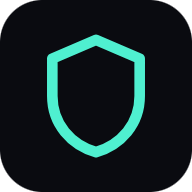

# Aegis Vault — Web App

A local-first encrypted vault that runs entirely in your browser and **shows you its own cryptography**. Every file gets its own salt, nonce, and authentication tag, and the app lets you inspect the raw bytes of the container it produced so you can verify that yourself.

Nothing is uploaded. There is no server, no account, no telemetry. The only network request the app ever makes is fetching its own static files on first load.

<p align="left">
  
</p>

---

## Try it on your phone

**Live app:** `https://xat01.github.io/AegisVault/`

1. Open that link in Chrome on Android (or Safari on iOS).
2. Tap the **Install** banner that appears at the bottom of the screen.
   - **Android / Chrome:** tap `Install`. The app is added to your home screen with its own icon and opens fullscreen, with no browser address bar.
   - **iOS / Safari:** there is no automatic install button — tap the **Share** icon, then **Add to Home Screen**. The app shows you this hint itself.
3. Launch it from your home screen. It works with no internet connection, forever.

> **Why an install instead of an APK?** This is a Progressive Web App. It installs to the home screen, runs fullscreen and offline, and behaves like a native app — but without a 60 MB download, without sideloading, and without the "install from unknown sources" warning. It also updates itself instantly whenever the repo is pushed to. If you specifically want a `.apk` to sideload, see [Building a real APK](#building-a-real-apk) at the bottom.

---

## Running it locally

The app needs a real HTTP origin — `file://` will not work, because browsers only expose the Web Crypto API on secure contexts, and service workers require an origin.

```bash
cd web
node serve.mjs
```

Then open **http://localhost:4321**.

No `npm install`, no build step. The whole app is plain ES modules loaded directly by the browser.

---

## What it does

- **Create a vault** protected by a passphrase, with a live strength meter and an entropy estimate.
- **Add files** by drag-and-drop, file picker, or paste. Anything up to 40 MB per file.
- **Unlock / lock** — the vault auto-locks after a configurable idle period.
- **Inspect any file** and see the exact container it was stored in: magic bytes, version, salt, nonce, and authentication tag, each colour-coded, alongside a hex dump you can read.
- **Verify integrity** — recompute the ciphertext hash and confirm it matches what was recorded at store time, or deliberately corrupt a value and watch the check fail.
- **Change your passphrase** without re-encrypting a single file (see the key-wrapping note below).
- **Search, filter, sort**, grid or list layout, bulk selection, drag-and-drop, and a command palette (`Ctrl`/`Cmd` + `K`).
- **Dark and light themes**, full keyboard navigation, focus trapping in dialogs, and `prefers-reduced-motion` support.

---

## The cryptography

Everything uses the browser's native **Web Crypto API**. No third-party crypto libraries, no hand-rolled primitives.

| Stage | Algorithm | Parameters |
| --- | --- | --- |
| Key derivation | PBKDF2-HMAC-SHA256 | 600,000 iterations, 16-byte random salt, 32-byte key |
| Encryption | AES-256-GCM | 256-bit key, 12-byte random nonce, 128-bit auth tag |
| Fingerprinting | SHA-256 | over the ciphertext, for integrity display |

### The container format

Every stored file becomes an `AEGS` container. The header is a fixed **49 bytes**:

```
offset  size  field
------  ----  ------------------------------------------
     0     4  magic      "AEGS"
     4     1  version    0x01
     5    16  salt       random, per file
    21    12  nonce      random, per file
    33    16  tag        GCM authentication tag
    49    ..  ciphertext the encrypted bytes
```

A container is therefore *exactly* 49 bytes larger than its plaintext. The test suite asserts this.

### Key wrapping — the design decision worth stealing

A naive vault derives the encryption key straight from your passphrase. That means changing your passphrase requires decrypting and re-encrypting **every file**, which is slow and risky.

This app wraps instead:

1. A random 32-byte **data key** is generated once, when the vault is created.
2. Your passphrase derives a **wrapping key** via PBKDF2.
3. The data key is encrypted under the wrapping key and stored.
4. Your files are encrypted with the data key, never with anything derived from your passphrase.

Changing your passphrase only rewrites the 49-byte wrapper. Your files are never touched. The test suite covers this.

---

## What this does **not** protect you from

Being honest about the threat model matters more than a feature list.

- **A compromised browser or machine.** If malware can run in your browser session while the vault is unlocked, it can read the key out of memory. Nothing in a web app can prevent this.
- **A weak passphrase.** 600,000 PBKDF2 iterations makes guessing expensive but not impossible. A short or common passphrase is still the weakest link, which is why the strength meter is deliberately strict.
- **Clearing your browser data.** Vault contents live in IndexedDB. Clearing site data, using private browsing, or a browser "clean up" tool will delete them. There is no server-side backup — that is the point, but it is also a real risk. The app asks the browser for persistent storage and tells you whether it was granted.
- **Losing your passphrase.** There is no recovery, no reset, no backdoor. That is the intended behaviour.
- **Traffic analysis / metadata.** There is no traffic, but the *existence* of files and their sizes are visible to anyone who can inspect your device's storage.

What it **does** protect: filenames and contents are unreadable at rest. The test suite verifies that plaintext never appears in IndexedDB and that a single flipped ciphertext bit is detected.

---

## Repository layout

```
web/
├── index.html              entry point, PWA meta tags
├── manifest.webmanifest    install metadata + icon set
├── sw.js                   service worker (offline shell + installability)
├── serve.mjs               dependency-free local server with a strict CSP
├── icons/                  generated PNG icon set (any + maskable)
└── src/
    ├── app.js              state, actions, render loop, boot
    ├── core/
    │   ├── crypto.js       PBKDF2 + AES-GCM primitives
    │   ├── container.js    AEGS pack / read / verify
    │   ├── keystore.js     passphrase → wrapped data key
    │   ├── db.js           IndexedDB blob + meta stores
    │   ├── vault.js        domain layer (the API the UI talks to)
    │   ├── events.js       emitter + passphrase scoring
    │   ├── format.js       human-readable formatting helpers
    │   └── constants.js    tunable limits
    ├── ui/
    │   ├── dom.js          tiny element builder
    │   ├── icons.js        inline SVG icon set
    │   ├── components.js   toasts, modals, drawers, command palette
    │   ├── install.js      install prompt + service worker registration
    │   └── screens/        auth, vault, inspector, settings
    └── styles/app.css      the design system
```

The rest of the repository (`AegisVault2/`) is the original C++ console vault this grew out of. It is kept for reference and is unrelated to the web app.

---

## Deployment

`.github/workflows/pages.yml` publishes the `web/` folder to GitHub Pages on every push to `app-demo` or `main`.

One-time setup: **Settings → Pages → Source → GitHub Actions**. After that, pushes deploy automatically.

The app uses only relative URLs, so it works correctly from the `/<repo>/` subpath without any rewrite rules.

---

## Security posture in the repo

- **No dependencies.** Nothing to `npm audit`, no supply chain to trust, no transitive packages.
- **No build step.** What is in the repo is byte-for-byte what the browser runs. There is no bundler that could inject something you did not read.
- **Strict CSP** served by `serve.mjs`: `default-src 'self'`, no inline scripts, `connect-src 'self'`, `object-src 'none'`, `frame-ancestors 'none'`.
- **The service worker never caches vault data.** Vault contents live in IndexedDB, and the worker is explicitly restricted to same-origin static shell assets so it cannot become a second, uncontrolled place where ciphertext lands on disk.
- **Secure context required.** The app detects a missing `crypto.subtle` at boot and explains the problem rather than failing later at first encrypt.

---

## Building a real APK

If you genuinely want a sideloadable `.apk`, the app is already structured for it — it is a static site, which is exactly what Capacitor wants. You would need:

- **JDK 17 or newer** (Android Gradle Plugin requires it; Java 8 will not work)
- **Android SDK** with build-tools and platform-tools (`ANDROID_HOME` set)
- **Gradle** (the wrapper is generated for you by Capacitor)

```bash
cd web
npm init -y
npm install @capacitor/core @capacitor/cli @capacitor/android
npx cap init "Aegis Vault" com.xat01.aegisvault --web-dir=.
npx cap add android
npx cap sync android
cd android && ./gradlew assembleDebug
```

The APK lands in `android/app/build/outputs/apk/debug/app-debug.apk`. Transfer it to your phone and open it (you will need to allow installs from unknown sources).

Two caveats specific to this app:

- **Web Crypto in a WebView** works, but the secure-context rules differ from a normal browser. Test the unlock flow on-device before trusting it.
- **IndexedDB persistence** in an Android WebView is subject to the same "system may clear app data" behaviour as a browser. Do not treat it as durable backup.

Because the PWA route already gives you an installable, offline, fullscreen app without any of this, the APK is only worth doing if you specifically need sideloading or Play Store distribution.

---

## Verification

The app was built with an automated test suite covering the crypto lifecycle, the full browser journey, and persistence across a real browser restart. The tests are what caught the two most serious bugs during development — a container-index slicing error that silently destroyed every item on lock/unlock, and a non-extractable key export that blocked vault creation entirely. Neither was visible by reading the code.

Key invariants asserted:

- Containers are exactly 49 bytes larger than their plaintext
- 50 containers produce 50 distinct nonces; 20 produce 20 distinct salts
- A single flipped ciphertext bit, or a modified nonce, is detected
- Empty payloads and 1 MB payloads round-trip byte-for-byte
- All 256 byte values survive encryption
- Plaintext never appears in IndexedDB; filenames are unreadable at rest
- Items survive a full browser close and reopen
- No horizontal overflow at 390 / 820 / 1440 px
- Zero uncaught runtime errors

---

## Licence

Personal project. Use it, read it, learn from it.
